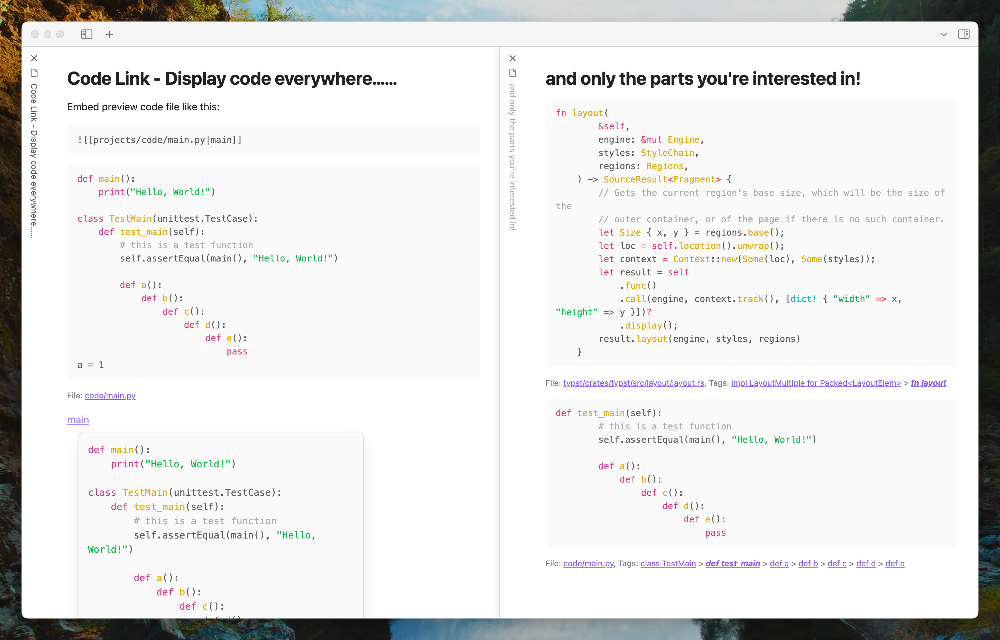

# Obsidian Code Link

  
 

Display code everywhere, and only the parts you're interested in!

- **Link to code files** as you would link to notes, and you can **preview their contents**. 
- Even better, through symbol search/tag search/code outline (or whatever you want to call it.), you can **link directly to a specific symbol in the code file** (such as a class, a function, or a method within a class). 

By creating links with symbols, you can reference only the code parts that interest you in your notes and avoid distractions from other code content. This is particularly useful when taking code notes (for example, when studying a complex open-source project).

# Usage

1. Create a folder in your obsidian repository for storing symlinks of your code projects, the default path is `projects`.
2. Open Command Palette and run `Code Link: Import project`, select the project folder you want to import, then the project will be imported into the folder you created in step 1.
3. Open editor, link to the code file just like linking to a note, then you can preview the code in the editor. 

## ⚠️ATTENTION 

- To be able to link to the code file with internal link, make sure that the **Settings - Files and Links - Detect all types of files** option are enabled.
- Before you perform a tag search, make sure that Settings - Code Link - **Enable tag search option** is enabled and necessary components have been downloaded (by **clicking the Download necessary components button**)

    

# Preview

Plugin supports both hover preview and embed preview of the code file.

    

    

Below the embed preview lists the link to the referenced code file, and the tag path to the current symbol (e.g., if you link to a method named methodB in a class named ClassA, the tag path is `class ClassA > def methodB`). When you click on a symbol in the tag path, the embed preview will temporarily switch the content of the displayed code to the content of that symbol.

# Tag Search

Place the cursor behind the code link (e.g. `[[main.py]]|`, where `|` is the cursor) will trigger tag search. The code link will be replaced when the specified symbol is selected in the tag search.

    

This feature is implemented with the help of [TreeSitter](https://tree-sitter.github.io/tree-sitter/) and [.scm files from the zed editor](https://zed.dev/).

# Import Project Into Obsidian Vault

Obsidian only allows to link to files within the vault, so you need to import the project into your vault before you can link to it.

To import a project, open command palette and run `Code Link: Import project`, then select the project folder you want to import. The project will be imported into the projects folder.

Note that "import" means create a symbol links (or file shortcuts in Windows) to the original files. Symlinks are just a reference to the original file, so if you delete the original file, the symlink will be broken.

# Q&A

## Q: Why embed preview/hover preview doesn't work in live preview mode?

Live preview mode uses a different mechanism than reading mode, so the plugin doesn't support it yet. Maybe it will be supported someday in the future!